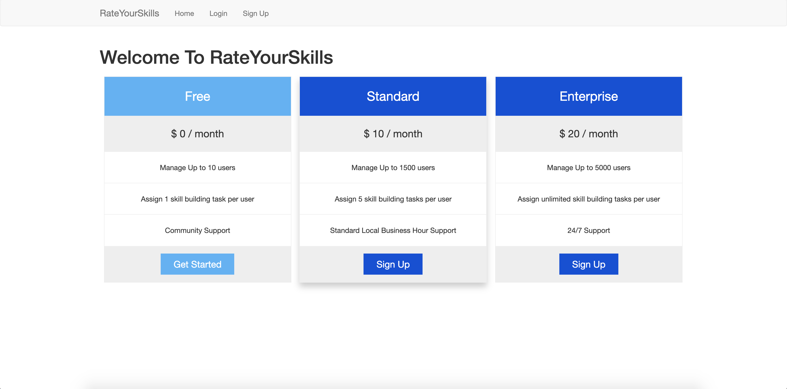
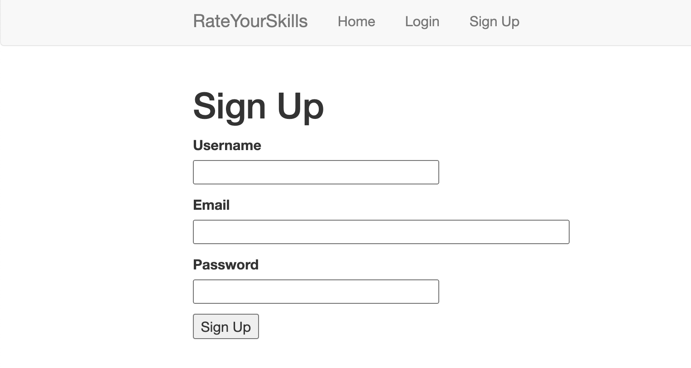
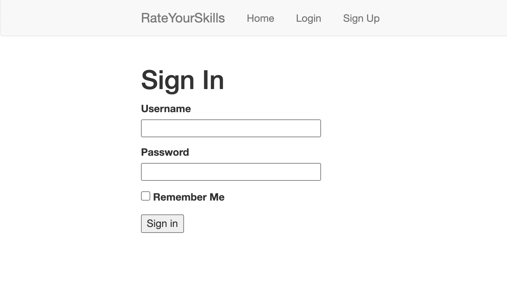
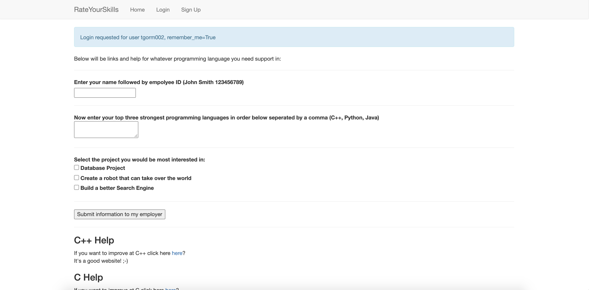

# cs175_Project

For this project my team and I were instructed to create anything that could be sold as a product. We decided that we would create a product called RateYourSkills, which would give employees a way to inform their employer which programming languages they are strongest in and what projects they would like to work on. As a team, we found that employees who were interested and skilled in the project they were working on almost always produced better work.

We created a basic website using python through the use of the Flask libraries, HTML, and CSS. Assuming that you do not have Flask installed on your computer, you cannot run the files. I have attached four screenshots below of what the website looks like. 

This first screenshot is our home page.

This second screenshot is the sign up page.

This third screenshot is our log in page.

This fourth screenshot is the page that will appear once the user has logged in. This page allows the user to input their information to submit to their employer. If the user wants, they can click on the links on this page to increase their programming skills in the languages shown below. 

